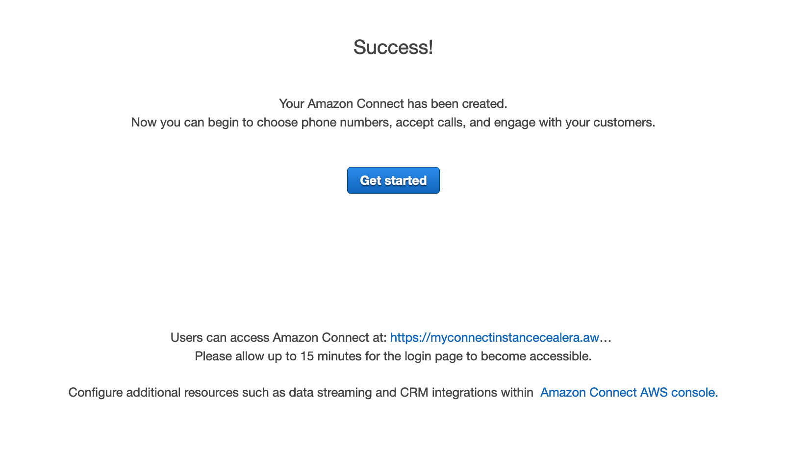
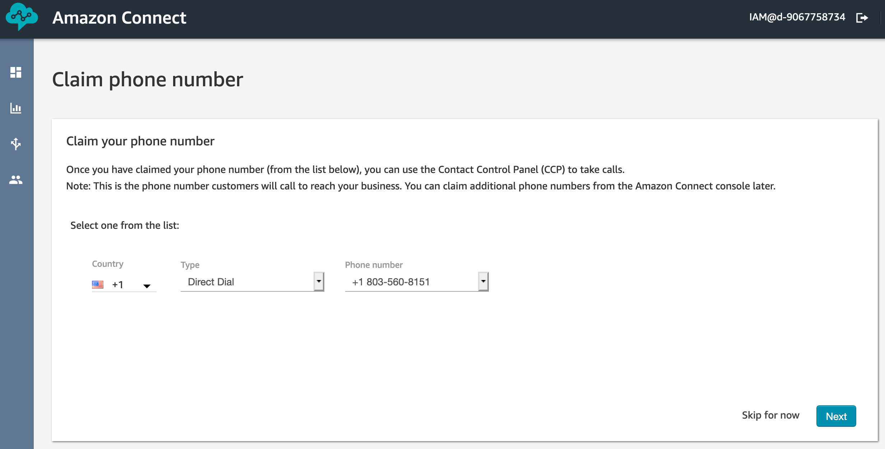
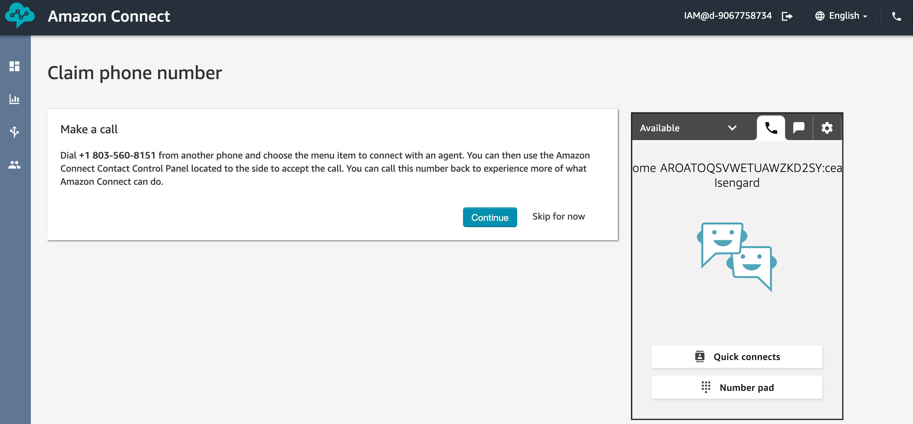
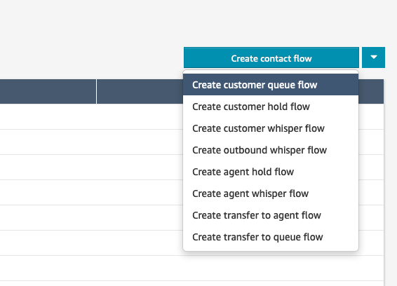
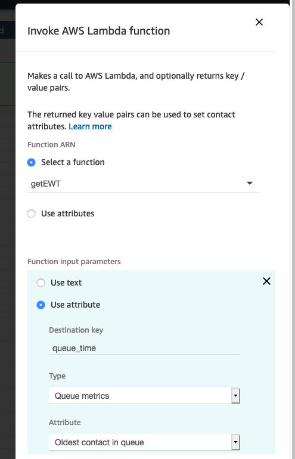
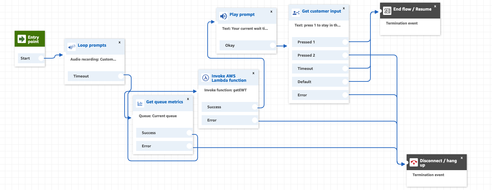
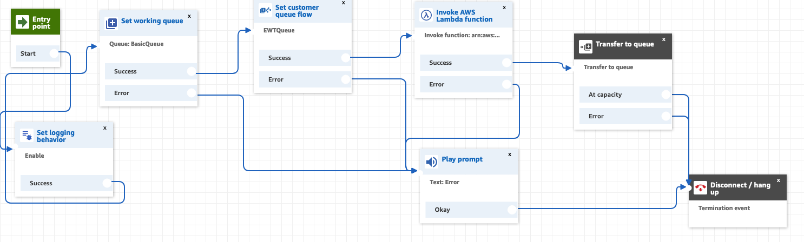

Knowing how much time a customer has to wait in a call center queue before being transferred to an agent is a useful functionality to have - unfortunately, Amazon Connect does not provide this metric out of the box.

What is does provide, however, is the wait time for the longest waiting customer in a given queue.

Based on this information, we will built a very simple, call-specific, EWT functionality.
The EWT will be dynamic and update itself as the customer spends more time in the queue and/or the queue metrics change.

The dynamic EWT will be presented to the customer while he/she is waiting in the queue, with the option to remain in the queue or hang up.


## What are we going to build?
1. A working instance of Connect
2. A simple contact flow to transfer incoming calls to a queue and a Customer Queue to loop the waiting music and insert the EWT message.

If you already have a Connect instance and are familiar with Amazon Connect, you can skip step 1.

## What services are we going to use?

1. Connect as the Contact Center solution and backbone for the other services
2. A DynamoDB table to store queue information 
3. Lambda functions to insert in the queue table and calculate and retrieve EWT
4. Cloudwatch to monitor and debug the solution
5. Polly to voice IVR dialogue

# 1. Intro to Amazon Connect (optional)

## Prepare the Environment 

### Launch an Amazon Connect instance
1. Log into the console.
2. Navigate to the Amazon Connect service page.
3. Select Add an instance
4. For identity management, choose Store users within Amazon Connect and enter a unique url to serve as an access point for your Contact center. Click Next.
   1. For production applications, it may make more sense to integrate with an existing directory, but for the purposes of today, let's use the built in user management capabilities.
5. For Create an Administrator page, add an admin identity.  You can use your IAM user to authenticate as an admin into the instance if you do not create a separate entity. Click Next.
6. For Telephony Options, make sure both incoming and outbound calls are selected. Click Next.
7. For Data storage, leave the default settings. Click Next.
8. Review and Create the instance.
9. Once the instance is created, select Get Started.




# 2. Getting Started with Amazon Connect (optional)

1. Access the instance.
   1. Navigate to the Amazon Connect access URL
   2. Connect with the Username and Password for the admin account.
2. Once you&#39;ve entered the Amazon Connect application, select &quot;Let&#39;s go&quot;.
3. Claim your phone number. The country should be the same as where your billing address is. Select Direct Dial number and click Next.


4. Wait a minute or so.  
5. Give yourself a call! Amazon Connect comes with a number of example contact flows to demonstrate different functionalities.
(Optional) Choose 1 > 1 > 1 in the IVR to get transfered to an agent and make the web client ring!




# 3. Building a simple call tracker 

We will use a DynamoDB table to store the callId, timestamp and EWT. For every call put into a queue, a Lambda function will lookup insert an item in the table. While waiting in a queue, another item will periodically query the table, update the EWT and return it to Connect.  


### 3.1 Creating the DynamoDB table

1. Log into the Amazon console.
2. Navigate to Services > DynamoDB
3. Click 'Create Table'. Name the table "queues" and use a "callId" field as the primary key.
4. Click Create.


### 3.2 Creating an IAM role used by Lambda to access DynamoDB

1. Log into the Amazon console.
2. Navigate to Services > IAM > Roles
3. Click Create Role
4. Choose AWS Service as the type of trusted entity and Lambda as the use case. 
5. Click Next: Permissions
6. Search for and select AmazonDynamoDBFullAccess. Click Next.
7. Enter a name (e.g. "ConnectDDBLambdaRole") and click Create Role.


### 3.3 Creating the putQueue Lambda

1. Log into the Amazon console.
2. Navigate to Services > Lambda
3. Click Create Function. If you have never used Lambda, you will get a slightly different get started screen - in this case, select Author from scratch.
4. Enter a name. Select Python 3.7 as the runtime. For permissions, use an existing role and select the role you created during the previous step. Click Create.
5. Navigate to the Function Code section and paste the following code:

```python
import boto3
from datetime import datetime

def lambda_handler(event, context):

    dynamodb = boto3.resource('dynamodb')
    
    table = dynamodb.Table('queues')
    
    #current time
    now = datetime.now()

    
    table.update_item(
    Key={
        'callId': event['Details']['ContactData']['ContactId']
    },
    UpdateExpression='SET times = :val1',
    ExpressionAttributeValues={
        ':val1': now.strftime("%m/%d/%Y %H:%M:%S")
    }
)

    response = table.get_item(Key={'callId':event['Details']['ContactData']['ContactId']})

    return response['Item']
```
6. Click Save.

### 3.4 Creating the getEWT Lambda

1. Perform the same steps as before for a new function: getEWT
2. For the Function Code use:

```python
import boto3
from datetime import datetime

#function to get the difference between two timestamps, in seconds
def date_diff_in_Seconds(dt2, dt1):
  timedelta = dt2 - dt1
  return timedelta.days * 24 * 3600 + timedelta.seconds

def lambda_handler(event, context):

    dynamodb = boto3.resource('dynamodb')
    table = dynamodb.Table('queues')
    queue_time = int(event['Details']['Parameters']['queue_time'])
    
    #current time
    now = datetime.now()
    
    #gets the item (row) from DDB based on call ID
    firstCall = table.get_item(Key={'callId':event['Details']['ContactData']['ContactId']})
    
    #gets the time when the customer was put in the queue and formats it
    firstCallTime = datetime.strptime(firstCall['Item']['times'], '%m/%d/%Y %H:%M:%S')
    
    #time spent in the queue so far
    difSeconds = date_diff_in_Seconds(now, firstCallTime)
    
    #estimated wait time for current customer is the result of the time spent so far in the queue substracted from the current longest wait time for that queue
    #if this is negative (e.g. for an empty queue), return 0
    if (queue_time-difSeconds < 0):
        ewt = 0
    else:
        ewt = queue_time-difSeconds
    
    #update the item with current ewt
    table.update_item(
    Key={
        'callId': event['Details']['ContactData']['ContactId']
    },
    UpdateExpression='SET ewt = :val1',
    ExpressionAttributeValues={
        ':val1': ewt
    }
)

    response = table.get_item(Key={'callId':event['Details']['ContactData']['ContactId']})

    #return current item, including updated ewt
    return response['Item']
```
6. Click Save.

### 3.5 Granting permissions for Lambda in Connect

1. Log into the Amazon console.
2. Navigate to Services > Amazon Connect. Select your Connect instance.
3. Select Contact Flows
4. Scroll down to the Lambda section and add the putQueue and getEWT functions you just created. Make sure to click +Add Lambda Function!

# 4. Create a custom Customer Queue

In Connect we will first create a custom Customer Queue. 
This will control what the customer hears while he is waiting in the queue.

1. Under Routing, select Contact Flows.
2. Click on the small arrow next to Create Contact Flow. Select Create Customer Queue Flow.



3. Enter the name EWTQueue.
4. Add the following blocks:
   * Loop Prompt (CustomerQueue.wav)
   * Get Queue Metrics
   * Invoke Lambda Function (getEWT, parameters: Use Attribute. Destination key: queue_time, Type: Queue Metrics, Attribute: Oldest Contact in the Queue)
   
   
   
   * Play Prompt (Your current wait time is $.External.ewt seconds)
   * Get Customer Input (1 - stay in the queue, 2 - disconnect, timeout and default - stay in the queue)
   * End flow/resume
   * Disconnect.
 4. Connect the blocks as shown. 
 
 
 
 5. Publish

# 5. Create a simple Contact Flow

We will create a very simple flow to put incoming calls into a queue. 

1. Under Routing, select Contact Flows.
2. Click Create Contact Flow. Name it QueueTimer
3. Add the following blocks:
   * Set Logging Behavior (enabled)
   * Set Working Queue (BasicQueue)
   * Set Customer Queue Flow (EWTQueue)
   * Invoke Lambda Function (putQueue)
   * Play Prompt (for error messages)
   * Transfer to Queue
   * Disconnect
4. Connect the blocks as shown.

 

5. Publish.
6. Attach the phone number you claimed to the QueueTimer flow.

# 6. Test

For the EWT to be other than 0, you will need to call in from at least 2 different numbers at the same time and have no agents available to take the calls.
For the first caller, the EWT will be 0, as he or she will be first in line to be serviced, as soon as an agent is available.
For the second caller, the EWT will be updated accordingly.

You can also monitor the DynamoDB table. Notice the EWT attribute.

# 7. Clean-up

1. Log into the Amazon console.
2. Navigate to Services > Amazon Connect. 
3. Click on the checkbox next to your Connect instance and click Remove.
4. Navigate to Services > DynamoDB > Tables.
5. Click on the checkbox next to your customers table and click Delete.
6. Navigate to Services > Lambda.
7. Click on the checkbox next to your get/updateCustomer functions and click Actions > Delete.

